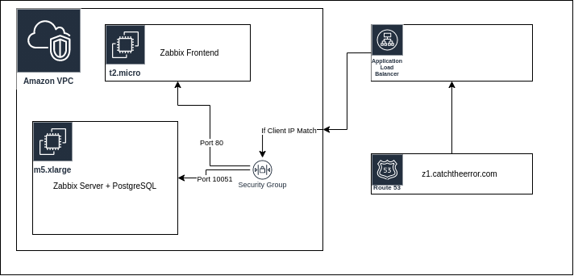

# CatchTheError Documentation

This project has been designed to increase the ability of small and medium-sized enterprises to monitor their technological infrastructure and to reduce these costs in terms of both human and server resources.

__Important Note:__ This application is a project that has been implemented without any commercial gain and has no financial return. For these reasons, the resources you can use within the application are limited. These limits are shown to you as a chart in the application. If the project works and sponsors emerge as a result, improvements to the system infrastructure will be considered.

## Table of Contents
- [Getting Started](#getting-started)
	- [Create Proxy](components/proxy/)
	- [Create User Group And Users](components/users-and-groups/)
	- [Create Host Group](components/host-groups)
	- [Create Host](components/hosts)
- [Automate Host Registration](#)
	- [Create Registration Script](#deployment)
	- [Create Network Discovery Rule](#deployment)
- [Alerting](#deployment)
	- [Create Trigger Action](#deployment)
- [Generals](#generals)
	- [Templates](components/templates)
	- [Macros](components/macros/)

## Getting Started

To use the application, it is enough to be a member. The monitoring infrastructure has been prepared by making improvements on Zabbix and its frontend. Its representation as a model is as follows.

