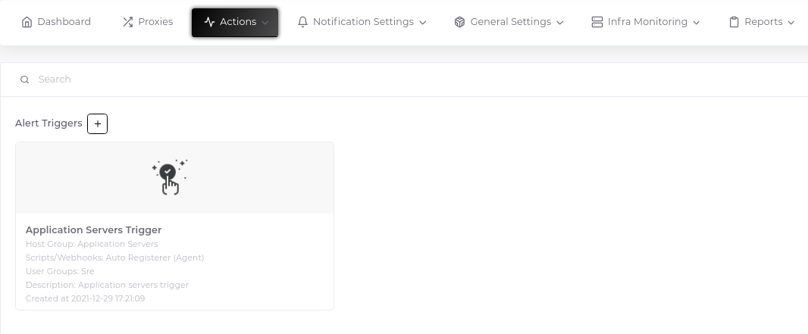
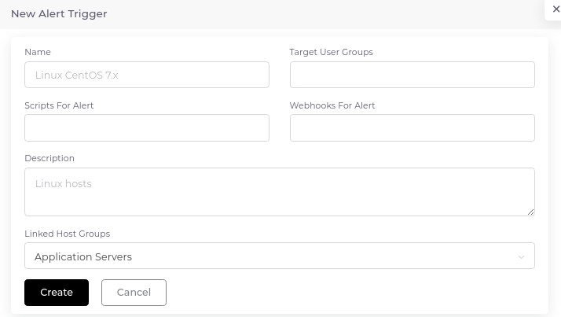
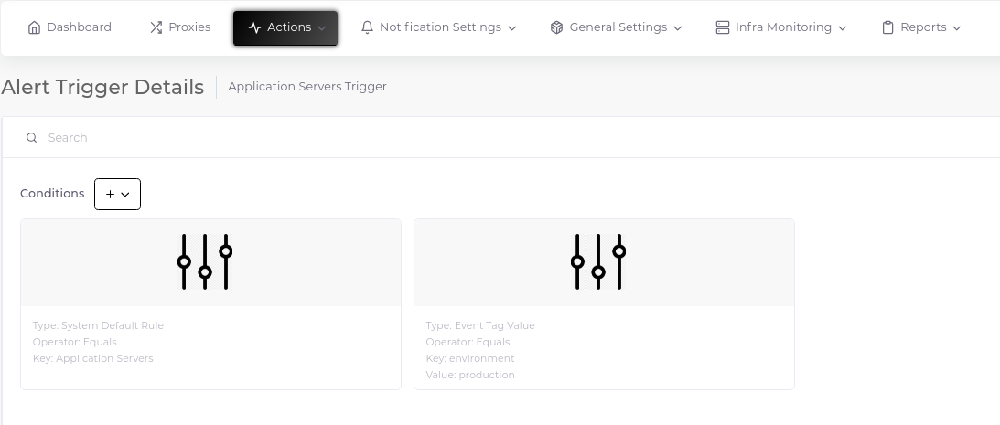
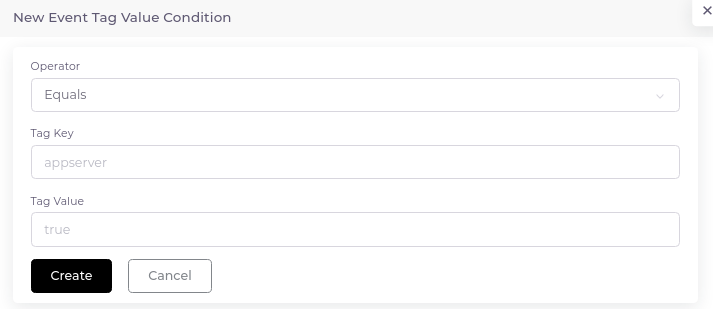

# Trigger Actions

Any alert that occurs in the system is processed thanks to the action set for this alert. You can run a script or get a notification for the incoming alarm. You can do both if you want.

## Create

Trigger action object consists of two separate components. Rule and condition.

### 1-) Create Rule

1. Go to "Actions > Triggers" and click the plus sign next to the "Alert Triggers" heading.

2. Fill in the relevant fields in the form that opens.

### 2-) Create Condition

1. Go to the "Details" page using the three dots in the upper right corner of the Trigger rule card.

2. Click the plus sign next to the "Conditions" heading and select the rule you want from the drop-down options.

3. Fill in the relevant fields in the form that opens.

