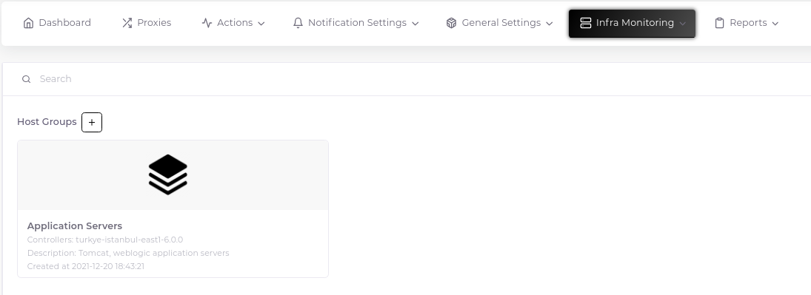
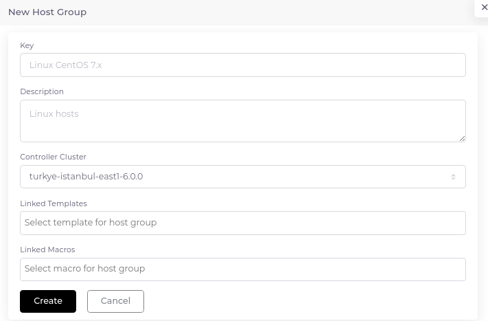

# Host Groups

Host groups are one of the most important parts of the system. General definitions for hosts can be made here. If an agile and automated system is to be designed, the key is to create a host group correctly.

## Create Host Group

1. Click the plus sign next to the "Host Groups" heading.

2. Fill in the relevant fields in the form that opens. At this point, the part you need to pay attention to is the choice of template. You can select multiple templates for a host group. According to the template type you choose (the phrases at the end of their names indicate which interfaces they use. For example, SNMP uses snmp interface), the interface is assigned to the hosts that will use this host group. Regarding the template properties, you can refer to [this page](../conmponents/templates).

__Important Note:__ This page talks about "Macros". You can get detailed information about macros and their working logic from [this page](https://www.zabbix.com/documentation/current/en/manual/config/macros).