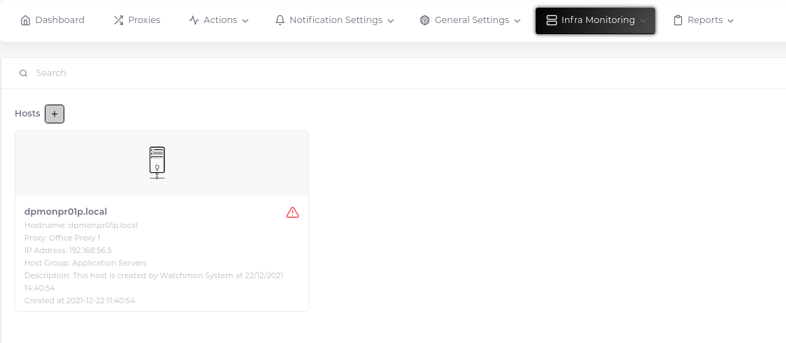
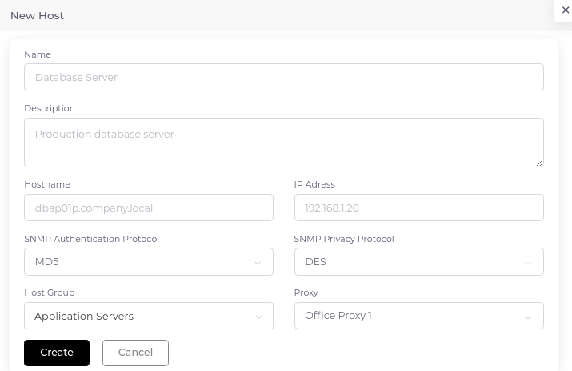

# Hosts

You can follow many methods for the hosts you will follow. Two of the most preferred methods are Agent and SNMP monitoring. In addition, JMX can be selected for some applications and IPMI for some Microsoft products.

There are two different methods for adding hosts. What will be described here will be adding using the interface. The monitoring side using the API will be the subject of the "Automate Host Registration" section.

## Create Host

1. Go to "Infra Monitoring > Hosts" and click the plus sign next to the "Hosts" heading.

2. Fill in the relevant fields in the form that opens. At this point, the following points should be noted.

	* The name field will be the display name of the added host in reports, alarms, in short on the Zabbix system. The name to be used when data is flowing over the host will be the host's real hostname, which you write in the "Hostname" field. [Active vs Passive agent](https://blog.zabbix.com/zabbix-agent-active-vs-passive/9207/)
	* If you are going to monitor with SNMP, do not forget to set the SNMP prefix settings on the form correctly. You can test and make sure these settings with the snmpwalk command over the relevant proxy server. Also, the SNMP monitoring system is set to v3 by default. Therefore, the macros below must be predefined for the respective hostgroup.
		* __SECURITY_NAME:__ Username
		* __AUTH_PASSPHRASE:__ Authentication passphrase
		* __PRIV_PASSPHRASE:__ Privacy passphrase

