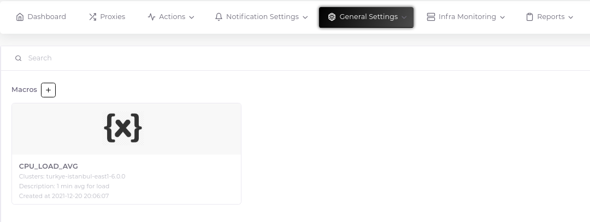
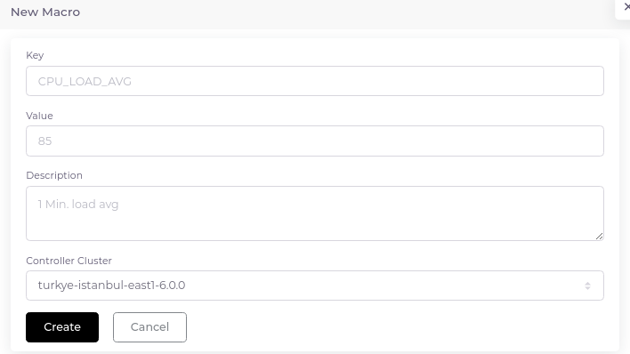

# Macros

Macros are simply variables that we define on the system and then in various places (scripts, alarms, etc.). One of the most important uses is the definition of hosts that use the same template but have different thresholds. For example, let the number of processes running on host A be 100 and on host B 200. The trigger defined as "Configured max number of processes is too low (< {$KERNEL.MAXPROC.MIN})" will decide whether to generate an alarm according to the definition in the "{$KERNEL.MAXPROC.MIN}" macro.

__Important Note:__ Built-in macros are used as "{MACRO}", while user defined macros are used as "{$MACRO}".

# Create Macro

1. Go to "General Settings > Macros" and click the plus sign next to the "Macros" heading.

2. Fill in the relevant fields in the form that opens.

