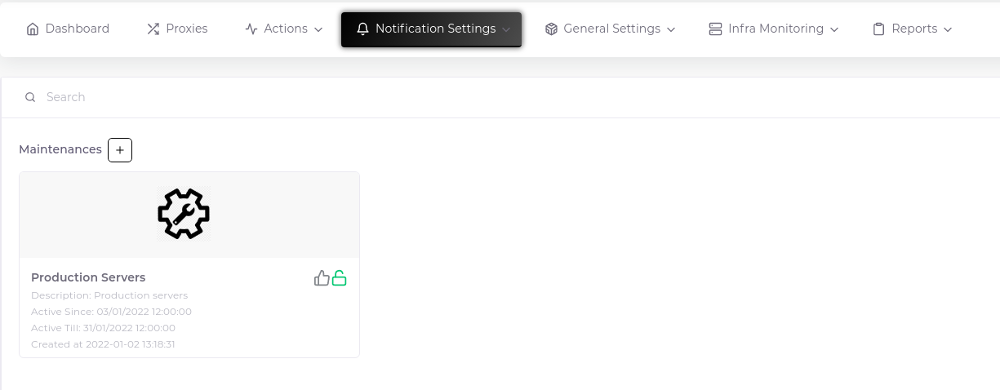
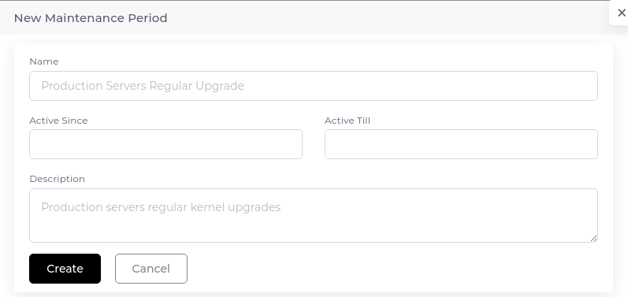
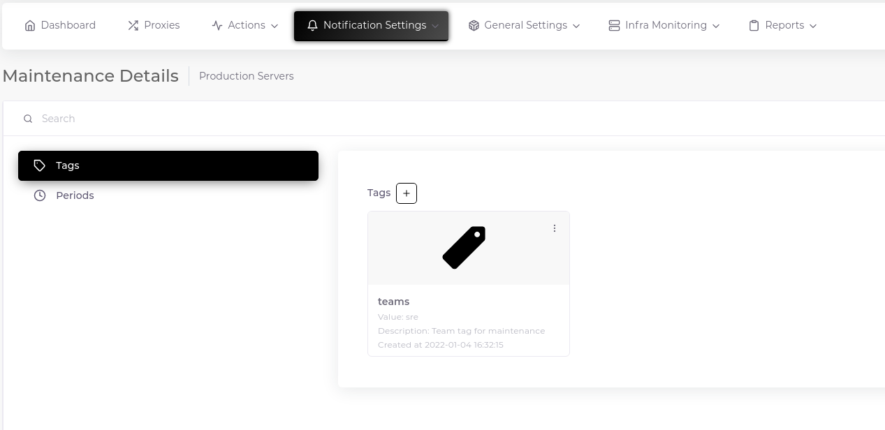
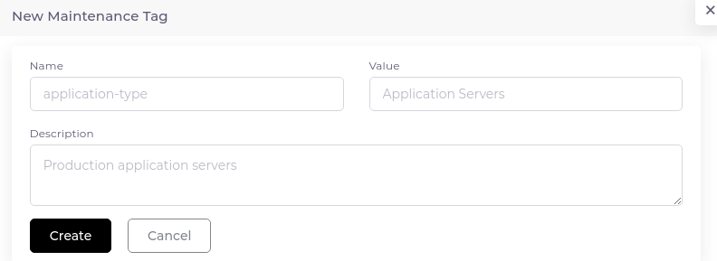
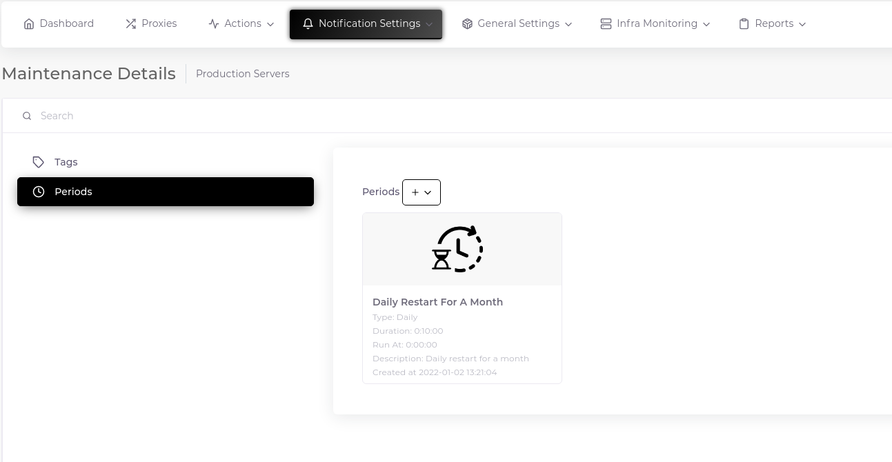
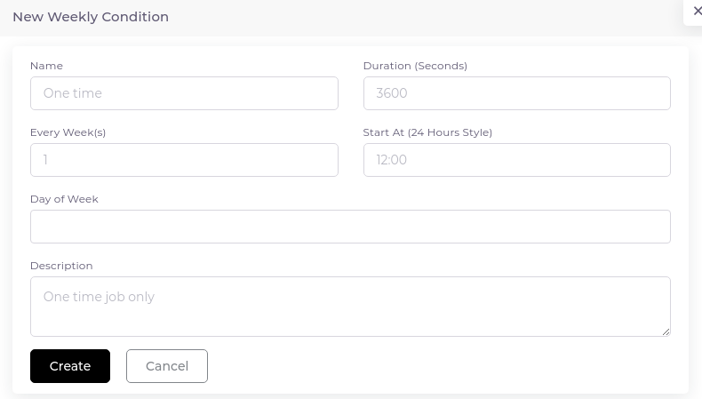

# Maintenances

You may want an alarm not to occur when performing one-time or repetitive tasks on certain systems, on certain dates. The "Maintenance" feature is ideal for this. You can set a long maintenance time and define certain periods within it.

For example, you might want to restart your web servers at 04:00 every night, and take a backup of some files at 08:00 every Monday. For this, you can determine a maintenance of one year and create two different time periods in it. You can also select the affected hosts with the help of tags.

#### Descriptions of Symbols on The Maintenance Card

1. __Lock__
	* __Green Lock On:__ Maintenance is active and available. (Add/delete tags, add/delete period)
	* __Black Lock Off:__ Maintenance is not available. (Adding/deleting tags, adding/deleting periods cannot be done)
2. __Thumbs__
	* __Green Thumbs Up:__ Your maintenance definition has been synchronized to the system and is active.
	* __Grey Thumbs Up:__ Your maintenance definition is waiting for sync.
3. __Alert Triangle__
	* __Red Alert Triangle:__ Your maintenance definition contains an error. You will see the error when you hover over the sign.

## Create

Maintenance object consists of three separate components. Maintenance, tags and periods.

### Create Maintenance

1. Go to "Notification Settings > Maintenance" and click the plus sign next to the "Maintenance" heading.

2. Fill in the relevant fields in the form that opens.

### Create Maintenance Host Tags

Host tags help you choose which servers to include in the study. As a working logic, tags with the same key are compared among themselves with "or" logic, while all tags are compared with "and" logic. For example, let's define three tags named "host-type: Application Servers", "host-type: Web Servers" and "environment: Production". These definitions will return us production servers with Application Server and Web Server tags.

1. Go to the "Details" page using the three dots in the upper right corner of the Maintenance card and click the plus sign next to the "Tags" heading.

2. Fill in the relevant fields in the form that opens.

### Create Maintenance Period

1. Go to the "Details" page using the three dots in the upper right corner of the maintenance card and click on the "Periods" heading in the left panel and click the plus sign next to the "Periods" heading.

2. Fill in the relevant fields in the form that opens.

