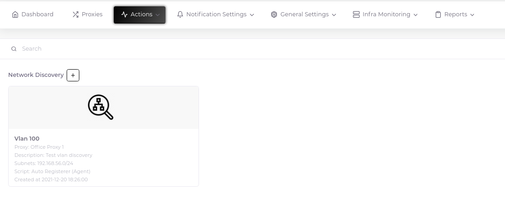
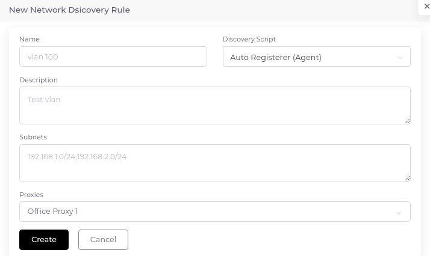
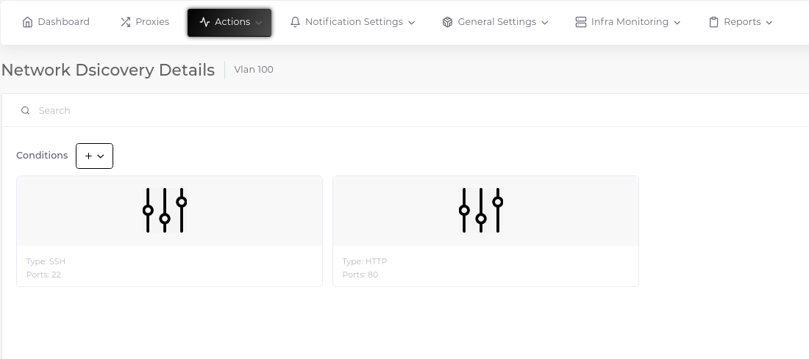
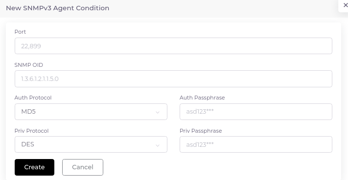

# Network Discovery

In the nature of monitoring jobs, there should be no unmonitored device. This requirement is often difficult to meet because there are so many different teams looking at our infrastructure and very different devices in our infrastructure. At this point, "Discovery Rules" comes to our aid.

## Create

Network discovery object consists of two separate components. Rule and condition.

__Important Note:__ In this section, a script is required to be triggered for the discovered devices. Before creating the rule, make sure you have created this script.

### 1-) Create Rule

1. Go to "Actions > Network Discovery" and click the plus sign next to the "Network Discovery" heading.

2. Fill in the relevant fields in the form that opens.

### 2-) Create Condition

1. Go to the "Details" page using the three dots in the upper right corner of the Discovery rule card.

2. Click the plus sign next to the "Conditions" heading and select the rule you want from the drop-down options.

3. Fill in the relevant fields in the form that opens.

