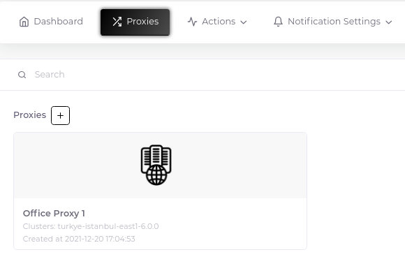
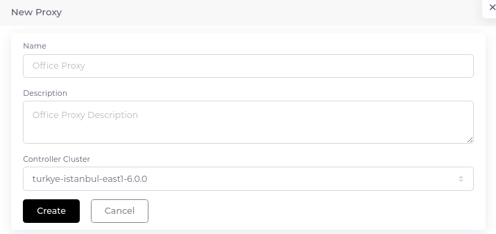
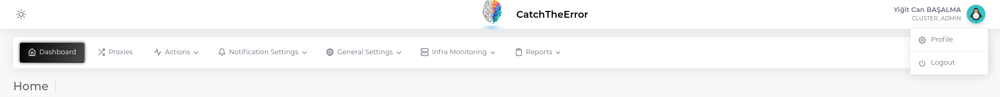
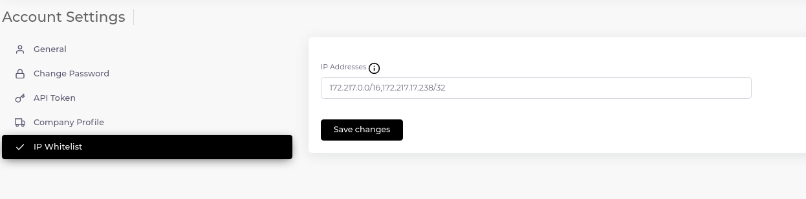

# Proxies

Proxy servers are small servers that you create within your own infrastructure to monitor your systems. The information collected through the hosts you have created is transmitted to Zabbix servers through these servers and processed there.

The system uses the "Active Proxy" option by default. This means that the proxy collects the data and forwards it to the central Zabbix servers, so the Zabbix servers do not send any traffic towards your systems.

__Important Note:__ In order to send data from your proxy server, you need to make the following arrangements.

1. Allowing port 10051 from your proxy server to the zabbix server address you have chosen.
2. Adding your proxy server's outgoing IP/subnet information to the "IP Whitelist" option. [How To Add?](#adding-ip-whitelist-records)

## Create First Proxy

1. Click the plus sign next to the "Proxies" heading.

2. Fill in the relevant fields in the form that opens.

After creation, click the three dots at the top right of the proxy card, then click the "Details" button to get the corresponding proxy configuration.

## Adding "IP Whitelist" Records

1. Click the button with your user information in the upper right corner and then select the "Profile" tab.

2. Click on the "IP Whitelist" tab from the left-hand navigation panel. As shown as an example, you can enter an address or a network directly.

