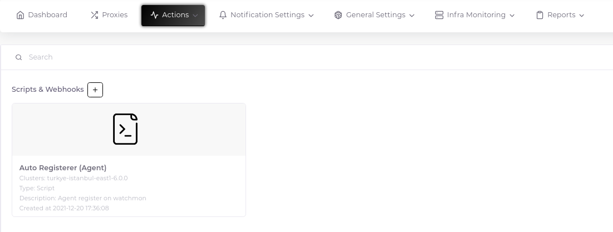
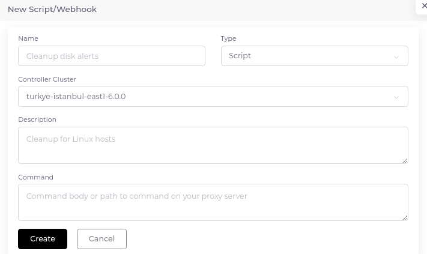

# Scripts

There are two main purposes for which scripts are used within the application. The first one is "Discover Action" and the second one is "Trigger Action". We will examine both usage purposes in detail in their respective fields. See, [Automate Host Registration](../components/host-auto-registration) & [Alerting](../components/alerting)


## Create Script

1. Go to "Actions > Scripts & Webhooks" and click the plus sign next to the "Scripts" heading.



2. Fill in the relevant fields in the form that opens.




__Important Note:__ You can use both the macros you created and the embedded macros in the scripts. For more information about built-in macros, you can get help [here](https://www.zabbix.com/documentation/current/en/manual/appendix/macros/supported_by_location).

```bash
# Example
curl -s -XPOST "https://api.example.com/incidents/create" -H 'accept: application/json' -d '{
	"incident-id": "{ACTION.ID}",
	"incident-name": "{ACTION.NAME}",
	"incident-hostname": "{HOST.NAME}",
	"incident-responder": "{$USER_DEFINED_MACRO}"
}'

```