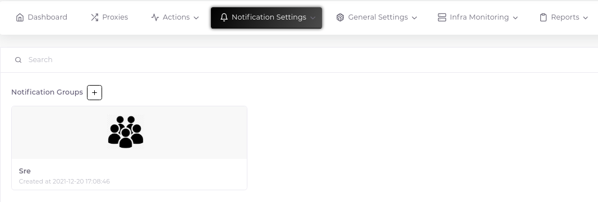
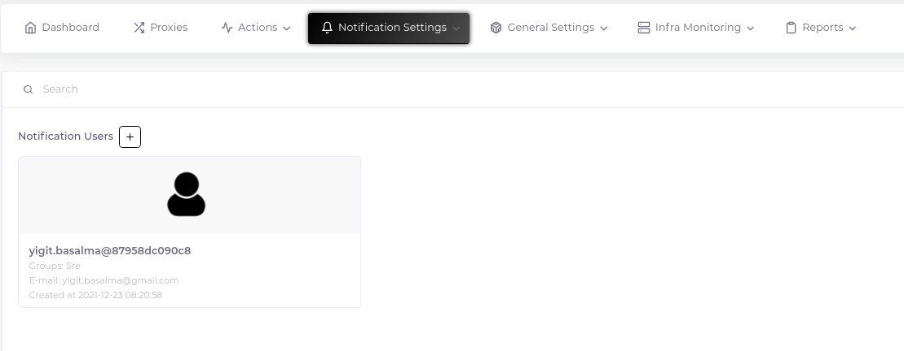

# User Groups and Users

In order to enter Zabbix's own interface, create alarms and scheduled reports, and connect with 3rd party applications such as Grafana, you need to create user groups and users connected to them.

## Create User Group

1. Click the plus sign next to the "Notification Groups" heading.

2. Fill in the relevant fields in the form that opens.

## Create User

1. Click the plus sign next to the "Notification Users" heading.

2. Fill in the relevant fields in the form that opens.

__Important Note:__ After the user is created, the name that appears on the user card is the user name defined on Zabbix, consisting of the e-mail address and customer ID. Username and password information is sent to the relevant user's e-mail account.